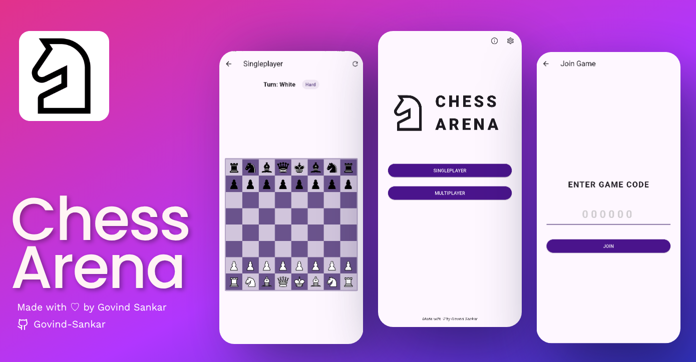
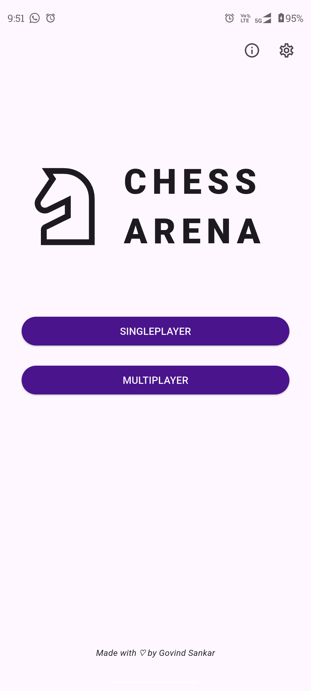
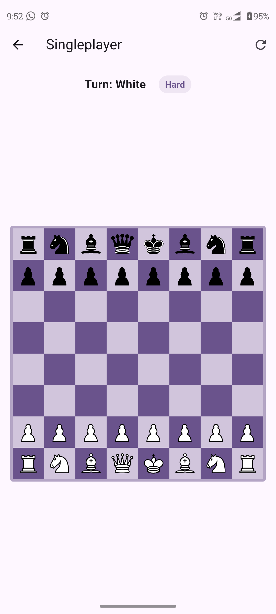
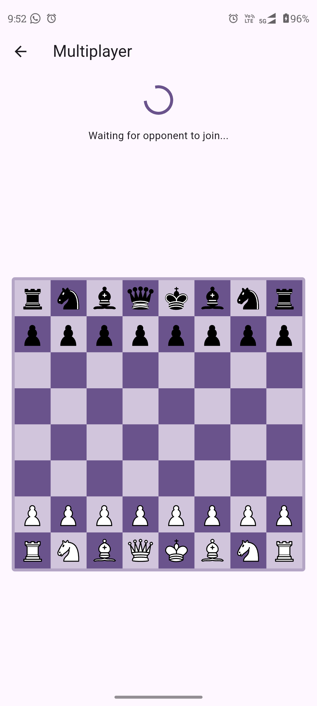
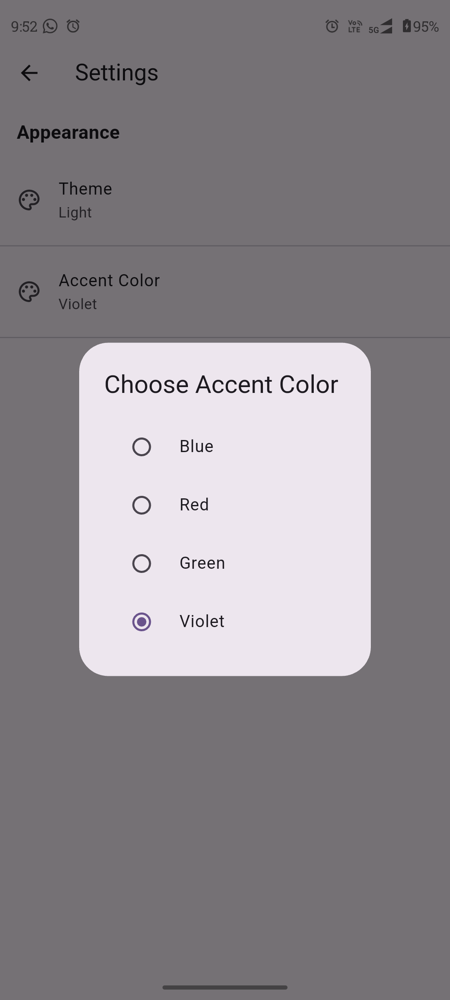

# Chess Arena

A modern chess app built with Flutter featuring both Singleplayer AI and real-time Multiplayer modes.

## Features

### Singleplayer Mode
- Play against AI
- Multiple difficulty levels (Easy, Medium, Hard)

### Multiplayer Mode
- Create private game rooms (6-digit code) and Join via code
- Online matchmaking with Real-time move synchronization

## Screenshots

<!--  -->

## Installation

1. Clone the repository:
```
git clone https://github.com/Govind-Sankar/chessarena.git
```

2. Install dependencies:

```
flutter pub get
```

3. Run the app:

```
flutter run
```

## Build APK

To generate release APK:

```
flutter build apk --release
```

Output file:

```
build/app/outputs/flutter-apk/app-release.apk
```
